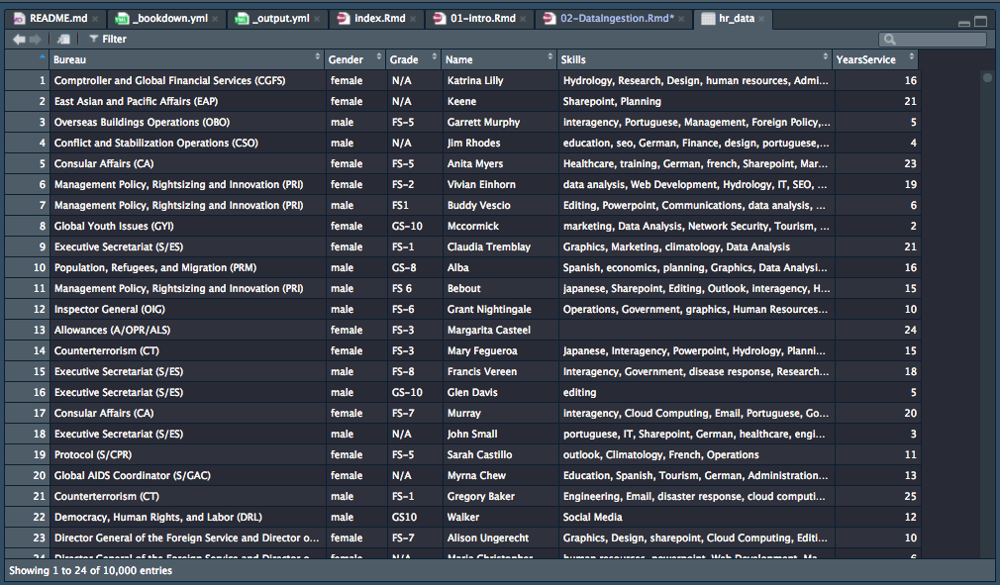

# Loading data into R

R can access data files from a wide variety of sources. These include

1. Text files (csv, tsv, fixed-width)
1. Microsoft Excel files
1. Microsoft Access databases
1. SQL-based databases (MySql, Postgresql, SQLite, Amazon Redshift)
1. Enterprise databases (SAP, Oracle)

The R package `rio` can help read and write to many file types that are single files, 
and the package `rodbc` can do the same for the databases. 


<details>
<summary> __Exercise:__ Install the R package `rio` into your R installation</summary>
```{r, warning=F, message = F, eval = F}
install.packages("rio", repos = "https://cran.rstudio.com") # Note the quotes
```
</details>


The `rio` package has a common way of reading data (using the `import` function). 
Importing the data will create an object called a data.frame, but if you
just import data, it is not saved since it doesn't yet have a name.

```{r, eval = F}
library(rio) # activate the package
import('data/HR_Data.csv') # can use single or double quotes
```

So every time you import data, you have to name it. You do this using the `<-` operator. 

```{r, echo = F}
library(rio)
```

```{r}
hr_data <- import('data/HR_Data.csv')
```

Now, if you type `hr_data` in the console, you will see the data you imported.

```{r}
head(hr_data) # This just displays the first 10 lines of the data
```

>  You have to name all the objects you create in R if you want to see them again. Try and pick a 
naming system that is simple yet descriptive, rather than `data1`. Two typical conventions that are used
are CamelCase and pothole_case. So you could name a dataset of operational budgets for January, 2019 as
`operations_budget_2019_jan` or `OperationsBudget2019Jan` or really anything you want, as long as it's
clear to you and doesn't include some forbidden characters like `-`, `@`,`$` which are reserved for 
other purposes, or doesn't start with a number. 

Seeing the data like this is certainly a bit awkward, especially for large datasets. 
In RStudio, you can see the data somewhat like a spreadsheet with the following command:

```{r, eval = F}
View(hr_data)
```

This results in a new pane in RStudio.



## Finer control of CSV imports

We can provide finer control over importing text files using additional options ("adverbs") to
the `import` function ("verb"). For example, it might be good to check if all the column
names are unique, and to make them not have spaces (which are awkward in terms of typing and functionality). You can add the option `check.names = TRUE` to the command:

```{r}
hr_data <- import('data/HR_Data.csv', check.names = TRUE)
```

Similarly, if you're using European data, where the decimal point is denoted by a comma, you can
add the following option:

```{r, eval = F}
hr_data <- import('data/HR_Data.csv', check.names = TRUE, dec = ',')
```

You can see most of the options in the help file for import, which you can access 
either from the `Help` pane, or by typing `?import` or `help(import)` in the console

## Finer control of Excel imports


