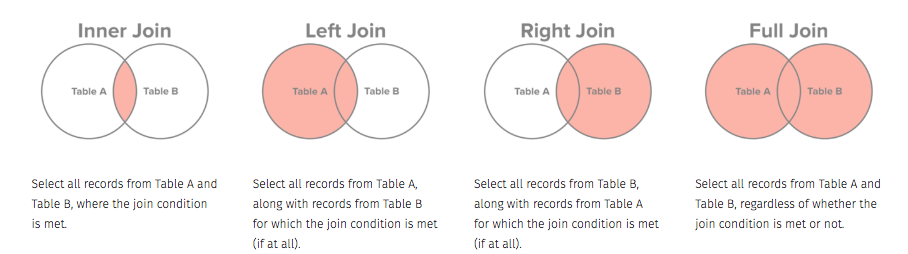

# Describing data {#sec:description}

```{r setup-dd, include=F}
library(tidyverse)
library(rio)
```


Data cleaning and munging is important, yet tedious work. Now that we're done
with that, we can get to the fun part of exploring the data. 

Our workhorse for this will be the `dplyr` package, part of the `tidyverse`. This
package provides 5 basic verbs:

- `filter`: filter a dataset by rows
- `select`: select columns of a dataset
- `arrange`: arrange rows of a dataset by values of some variables
- `group_by`: split a dataset by values of some variables, so that we can apply verbs to each split
- `summarize`: compute various summaries from the data

`dplyr` also has verbs to let stitch datasets together, which are `left_join`, 
`right_join`, `inner_join`, `outer_join`, `semi_join`, `anti_join`, `bind_rows` and
`bind_cols`.

I'll be using the latest `dplyr`, version `r packageVersion('dplyr')`. If you have 
an older version, most but not all things will work. 

We'll start with the in-build `mtcars` dataset. 

```{r Data-Description-1}
library(tidyverse)
mtcars1 <- mtcars %>% rownames_to_column('cars') %>% as_tibble()
mtcars1
```

Let's get some summary statistics from this dataset. First, let's compute the average 
mpg, displacement, and horsepower of these cars.

```{r Data-Description-2}
mtcars1 %>% summarize(mpg = mean(mpg, na.rm=T), disp = mean(disp, na.rm=T), hp = mean(hp, na.rm=T))
```

> I'm adding the option `na.rm=T` to remove any missing values; if there is even a single missing value, the mean will be computed as `NA`

Most `dplyr` verbs also have scoped versions `*_all`, `*_at`, `*_if`, which can be useful. The `*_any` versions act
upon all the columns, the `*_at` versions on specified columns (same way columns are specified in `select`) and the 
`*_if` versions on columns with particular properties. So the above  code could be written as

```{r Data-Description-3}
mtcars1 %>% summarize_at(vars(mpg, disp, hp), mean, na.rm = T)
```

### Factors or categorical variables {-}

R has a data type called a `factor`, which is meant for categorical or discrete variables; things like sex, race, and, 
in this data, `cyl`. We need to transform the column to this data type first. 

```{r Data-Description-4}
mtcars1 <- mtcars1 %>% 
  mutate(cyl = as.factor(cyl))
```

There are a few others that might need this treatment.

```{r Data-Description-5}
mtcars1 <- mtcars1 %>% 
  mutate_at(vars(cyl, vs, am, gear, carb), as.factor)
```

Let's see what we've done.

```{r Data-Description-6}
str(mtcars1)
```

Now, let's compute averages of all the non-factor, or numeric, variables.

```{r Data-Description-7}
mtcars1 %>% summarize_if(is.numeric, mean)
```

We can get a summary of all the variables using the function `summary`.

```{r Data-Description-8}
summary(mtcars1)
```

However, this does not give us a tidy dataset. Some alternatives are the `skimr` package and 
the `ezsummary` package. 

```{r Data-Description-9}
# install.packages('skimr')
library(skimr)
skim(mtcars1)
```

## Split-apply-combine, a.k.a. MapReduce

The split-apply-combine is a powerful paradigm for understanding subgroups within a dataset. The basic 
idea is that you split the data into pieces based on values of some variables, do something (the same thing) to 
each piece, and then stitch the results back together. 


For example, in the mtcars data, we might want to know what the average mpg is by the number of cylinders. The
way to do this is:

```{r Data-Description-10}
mtcars1 %>% 
  group_by(cyl) %>% 
  summarize(mpg_mean = mean(mpg))

```

Once again, the scoped versions of `summarize` will also work in this pipe

```{r Data-Description-11}
mtcars1 %>% 
  group_by(cyl) %>% 
  summarize_if(is.numeric, mean)
```

Let's go a bit further and compute the medians as well.

```{r Data-Description-12}
mtcars1 %>% 
  group_by(cyl) %>% 
  summarize_if(is.numeric, list('mean'= mean, 'median' = median))
```

We can look at a second dataset showing individual violent incidents in Western Afrika
between 2000 and 2017. We can get the number of incidents per country and year very easily using this paradigm.

```{r Data-Description-13}
west_africa <- import('data/2000-01-01-2019-01-01-Western_Africa.csv')
west_africa %>% group_by(country, year) %>% tally()
```

For display, we can make this a wide dataset

```{r Data-Description-14}
west_africa %>% group_by(country, year) %>% tally() %>% 
  spread(year, n)
```

We'll save this dataset for visualization later.

```{r Data-Description-15}
west_africa %>% group_by(country, year) %>% tally() %>% 
  spread(year, n) %>% 
  saveRDS('data/west_africa.rds')
```


## Joins

We mentioned earlier that there are several kinds of ways we can join data. The 
different kinds of joins are described below.



Let's look at these joins with an example. We have two simulated datasets looking at 
DOS real estate allocation and staffing. We will look at how much area on average each
bureau has given the number of employees

```{r Data-Description-16}
staffing_data <- import('data/Staffing_by_Bureau.csv') %>% as_tibble()
real_estate <- import('data/DoS_Real_Estate_Allocation.csv') %>% as_tibble()
real_estate
staffing_data
```
The strategy is going to be to do a grouped summary of the staffing data to see how 
many people are in each Bureau, and then join that with the real estate data to 
compute the average area per employee by Bureau.

```{r Data-Description-17, message=T}
staff_summary <- staffing_data %>% 
  group_by(Bureau) %>% 
  tally(name = 'Pop')
realestate_summary <- real_estate %>% 
  group_by(Bureau) %>% summarize(Size = sum(Size))
realestate_summary %>% left_join(staff_summary) %>% 
  mutate(unit_area = Size/Pop) %>% 
  arrange(unit_area)
```


