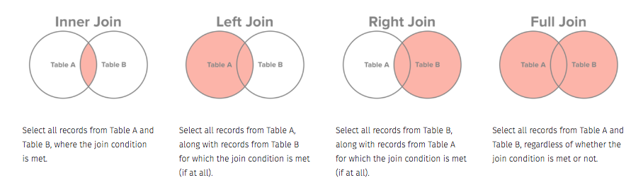

## The `select` function


```{r Day2-Summaries-1, include=FALSE}

knitr::opts_chunk$set(echo = TRUE, comment = "")
library(rio)
library(tidyverse)

```

The `select` function selects variables (columns) from your dataset. We will look 
at some nice selection methods using a dataset of all foreign aid disbursements from 
Department of State between 2004 and 2017. 

```{r Day2-Summaries-2 }
library(rio)
dos <- import('data/Department of State.csv') %>% as_tibble()
 names(dos)

```

There are several groups of variables by name, and `dplyr` provides nice functions
to extract them.

```{r Day2-Summaries-3, echo=F}
dos %>% select(starts_with("Award"))

```
```{r Day2-Summaries-4, echo=T}
dos %>% select(ends_with("Value"))

```
```{r Day2-Summaries-5, echo=T}
dos %>% select(contains("Transaction"))

```

There are several other helper functions that can grab variables based on 
properities of their names. 

- starts_with(): Starts with a prefix.
- ends_with(): Ends with a suffix.
- contains(): Contains a literal string.
- matches(): Matches a regular expression.
- num_range(): Matches a numerical range like x01, x02, x03.
- one_of(): Matches variable names in a character vector.
- everything(): Matches all variables.
- last_col(): Select last variable, possibly with an offset.

We can pipe these too. In the next bit, we are trying to get the variables that 
representing start dates. We are using the `pull` function to grab the data out of the dataset
in the form of an array, just so it's easier to manipulate. 

```{r Day2-Summaries-6 }
start_dates <-  dos %>% 
  select(ends_with("Date")) %>% 
  select(contains("Start")) %>% 
  pull(1)
  
head(start_dates)
```


## Dates

__Resource__: [RStudio cheatsheet](https://rawgit.com/rstudio/cheatsheets/master/lubridate.pdf)


Dates are a first-class data type in R, though they are natively somewhat difficult to 
manage. The package `lubridate` added several convenience functions to make this work
much easier.

```{r Day2-Summaries-7 }
library(lubridate)
start_dates <- as_date(start_dates) %>% head()
start_dates
year(start_dates)
month(start_dates)
day(start_dates)

```
```{r Day2-Summaries-8 }
sort(start_dates)
quarter(start_dates)
days(start_dates) - days(as_date('2011-10-01')) # Days from start of fiscal year

```
So we see that we can do math with dates to identify intervals of time, in
appropriate units. 

# Joins

We are often in the situation that pieces of data are resident in different tables, 
and we need to put them together for analyses. Usually each table will have some type 
of identifier variable that identifies the unit with which each observation is 
associated. Joins use these identifiers to put datasets together while maintaining
correspondence of the data with the actual units. 

There are 4 primary kinds of joins:



Let's summarize what can happen with joins:

```{r Day2-Summaries-9, echo=F}
d <- tribble(
  ~ Type, ~Rows, ~Columns,
  'inner', 'same or decrease', 'increase',
  'left', 'same as left dataset','increase',
  'right', 'same as right dataset','increase',
  'full','increase','increase')
knitr::kable(d)

```

We'll play with two simulated datasets looking at staffing and real estate allocation at 
DOS. The question we're asking is, what is the area avaiable per capita in each Bureau. 
```{r Day2-Summaries-10 }
staffing_data <- import('data/Staffing_by_Bureau.csv')
real_estate <- import('data/DoS_Real_Estate_Allocation.csv')

```
```{r Day2-Summaries-11 }
staffing_data %>% as_tibble()
real_estate %>% as_tibble()

```
First we summarize the data by Bureau
```{r Day2-Summaries-12, message=T}
staff_summary <- staffing_data %>% 
  group_by(Bureau) %>% 
  tally(name = 'Pop')
realestate_summary <- real_estate %>% 
 group_by(Bureau) %>% summarize(Size = sum(Size))

```
```{r Day2-Summaries-13 }
staff_summary %>% head(4)
realestate_summary %>% head(4)

```
Then we join the two datasets together. They will join based on the Bureau variable, 
which is common to both datasets. 

```{r Day2-Summaries-14 }
staff_summary %>% 
  inner_join(realestate_summary, by = c("Bureau" = "Bureau"))

```

Once we have joined the datasets, we can now create a variable that computes the area per capita, and then we sort the rows of the data in order of descending area per capita. 
```{r Day2-Summaries-15 }
staff_summary %>% 
  inner_join(realestate_summary, by = c("Bureau" = "Bureau")) %>% 
  mutate(unit_area = Size/Pop) %>% 
  arrange(unit_area)


```

# Data summaries

The `dplyr` package gives us 5 verbs to operate on a single data frame:

- `filter`: filter a dataset by rows
- `select`: select columns of a dataset
- `arrange`: arrange rows of a dataset by values of some variables
- `group_by`: split a dataset by values of some variables, so that we can apply verbs to each split
- `summarize`: compute various summaries from the data

It also gives us verbs for joining 2 data frames:

- `left_join`
- `right_join`
- `inner_join`
- `outer_join`
- `semi_join` : Keep rows of left dataset which correspond to rows in right dataset
- `anti_join` : Keep rows of left dataset which __do not__ correspond to rows in right dataset
- `bind_rows` : Stack two datasets on top of each other, provided they have the same number of columns
- `bind_cols` : Put two datasets side by side, provided they have the same number or rows. 
]


```{r Day2-Summaries-16 }
library(tidyverse)
mtcars1 <- mtcars %>% rownames_to_column('cars') %>% as_tibble()
mtcars1

```

We can compute different summaries over the variables in a dataset. 
```{r Day2-Summaries-17 }
mtcars1 %>% summarize(mpg = mean(mpg, na.rm=T), disp = mean(disp, na.rm=T), hp = mean(hp, na.rm=T))

```

## Scoped verbs

All the `dplyr` verbs have scoped versions `*_all`, `*_at` and `*_if`.

1. `*_all` : Act on all columns
1.  `*_at`  : Act on specified columns
1.  `*_if`  : Act on columns with specific property

## Factors (categorical variables)

`factor` types of variables are discrete or categorical variables, that only take
a small set of values. Think number of cylinders in a car, race, sex. 
We can covert a variable to a factor using `as.factor`. (There are also 
`as.numeric` and `as.character`). 

```{r Day2-Summaries-18 }
dos %>% mutate_at(vars(ends_with("Date")), as_date) %>% 
  summarise_if(is.Date, max)

```

Here, we notice that a couple of the values are `NA`. We would like to add the 
`na.rm=T` option into the mean function. We can do that, as long as we put a `~` before
it. The `.` is a place holder for each variable that will be interrogated here. 

```{r Day2-Summaries-19 }
dos %>% mutate_at(vars(ends_with("Date")), as_date) %>% 
  summarize_at(vars(ends_with("Date")), ~max(., na.rm=T))

```
```{r Day2-Summaries-20 }
mtcars1 <- mtcars1 %>% 
  mutate_at(vars(cyl, vs, am, gear, carb), as.factor)
str(mtcars1)

```
```{r Day2-Summaries-21 }
mtcars1 %>% summarize_if(is.numeric, mean)

```

# Split-apply-combine


Here, we compute summaries (means) by levels of cylinders. 
```{r Day2-Summaries-22 }
mtcars1 %>% 
  group_by(cyl) %>% 
  summarize(mpg_mean = mean(mpg))

```
We can still use scoped verbs if we want.
```{r Day2-Summaries-23 }
mtcars1 %>% 
  group_by(cyl) %>% 
  summarize_if(is.numeric, mean)

```
We can also do several summaries in one go. 
```{r Day2-Summaries-24 }
mtcars1 %>% 
  group_by(cyl) %>% 
  summarize_if(is.numeric, list('mean' = mean, 'median' = median))

```

Let's go back to the DOS dataset. We're going to see how much money was given to 
each implementatoin organization over the years. 
```{r Day2-Summaries-25 }
dos %>% 
  group_by(Implementing_Organization) %>% 
  summarize(amt = sum(Award_Transaction_Value)) %>% 
  arrange(desc(amt))

```

We can also split by organization type
```{r Day2-Summaries-26 }
dos %>% 
  group_by(Implementing_Organization_Type) %>% 
  summarize(amt = sum(Award_Transaction_Value)) %>% 
  arrange(desc(amt))

```
If we want to look at time trends, we will also need to split by year, in addition to 
the organization. We're using some `lubridate` code to make the years accessible to 
the computer. 

```{r Day2-Summaries-27 }
dos_by_year <- dos %>% 
  group_by(Implementing_Organization, year = year(as_date(Award_Start_Date))) %>% 
  summarize(amt = sum(Award_Transaction_Value)) %>% 
  filter(Implementing_Organization != '', !is.na(year)) 

```
We can also look at the overall trends by year. 
```{r Day2-Summaries-28 }
dos_by_year %>% 
  group_by(year) %>% 
  summarize(amt = sum(amt))
```

