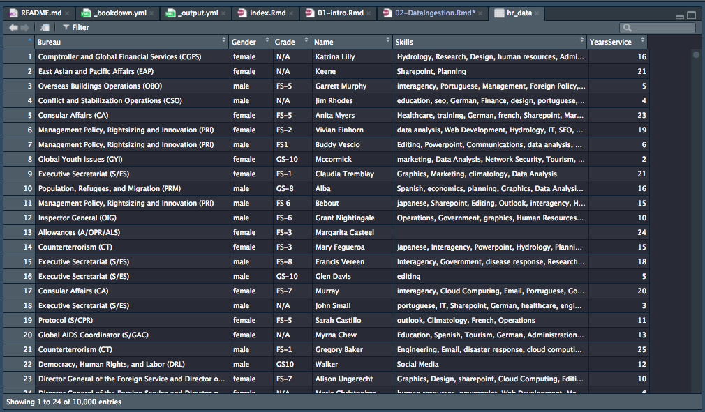

# Loading data into R

R can access data files from a wide variety of sources. These include

1. Text files (csv, tsv, fixed-width)
1. Microsoft Excel files
1. Microsoft Access databases
1. SQL-based databases (MySql, Postgresql, SQLite, Amazon Redshift)
1. Enterprise databases (SAP, Oracle)

The R package `rio` can help read and write to many file types that are single files, 
and the package `rodbc` can do the same for the databases. 


<details>
<summary> __Exercise:__ Install the R package `rio` into your R installation</summary>

```r
install.packages("rio", repos = "https://cran.rstudio.com") # Note the quotes
```
</details>


The `rio` package has a common way of reading data (using the `import` function). 
Importing the data will create an object called a data.frame, but if you
just import data, it is not saved since it doesn't yet have a name.


```r
library(rio) # activate the package
import('data/HR_Data.csv') # can use single or double quotes
```

So every time you import data, you have to name it. You do this using the `<-` operator. 


```r
hr_data <- import('data/HR_Data.csv')
```

Now, if you type `hr_data` in the console, you will see the data you imported.


```r
head(hr_data) # This just displays the first 10 lines of the data
```

```
##                                                Bureau Gender Grade
## 1    Comptroller and Global Financial Services (CGFS) female   N/A
## 2                East Asian and Pacific Affairs (EAP) female   N/A
## 3                 Overseas Buildings Operations (OBO)   male  FS-5
## 4         Conflict and Stabilization Operations (CSO)   male   N/A
## 5                               Consular Affairs (CA) female  FS-5
## 6 Management Policy, Rightsizing and Innovation (PRI) female  FS-2
##             Name
## 1  Katrina Lilly
## 2          Keene
## 3 Garrett Murphy
## 4     Jim Rhodes
## 5    Anita Myers
## 6 Vivian Einhorn
##                                                                                           Skills
## 1                                   Hydrology, Research, Design, human resources, Administration
## 2                                                                           Sharepoint, Planning
## 3                interagency, Portuguese, Management, Foreign Policy, Economics, Human Resources
## 4                   education, seo, German, Finance, design, portuguese, disease response, Excel
## 5 Healthcare, training, German, french, Sharepoint, Marketing, Data Analysis, Economics, spanish
## 6                 data analysis, Web Development, Hydrology, IT, SEO, Disease Response, Japanese
##   YearsService
## 1           16
## 2           21
## 3            5
## 4            4
## 5           23
## 6           19
```


Seeing the data like this is certainly a bit awkward, especially for large datasets. 
In RStudio, you can see the data somewhat like a spreadsheet with the following command:


```r
View(hr_data)
```

This results in a new pane in RStudio.



## Finer control of CSV imports

We can provide finer control over importing text files using additional options ("adverbs") to
the `import` function ("verb"). For example, it might be good to check if all the column
names are unique, and to make them not have spaces (which are awkward in terms of typing and functionality). You can add the option `check.names = TRUE` to the command:


```r
hr_data <- import('data/HR_Data.csv', check.names = TRUE)
```

Similarly, if you're using European data, where the decimal point is denoted by a comma, you can
add the following option:


```r
hr_data <- import('data/HR_Data.csv', check.names = TRUE, dec = ',')
```

You can see most of the options in the help file for import, which you can access 
either from the `Help` pane, or by typing `?import` or `help(import)` in the console

## Finer control of Excel imports

You can specify sheet names or sheet positions for import from an Excel file. If you 
know the sheet name, you can specify it using the `which` option:


```r
dos_data <- import('data/simulatedDOS.xlsx', which='Staffing_by_Bureau')
```

You can also grab the same sheet by position:


```r
dos_data <- import('data/simulatedDOS.xlsx', which = 2)
```

We'll talk about how to grab multiple sheets together into a list in the data munging section\@ref(sec:data-munging). 

## Importing data from databases

If you have data in an Access database, you can read it in pretty easily using 
the `RODBC` package. To import one particular table from Access, you can use


```r
library(RODBC) # activate package, case-sensitive
channel <- odbcConnectAccess('C:/Documents/Name_of_Access_Database') # change to your
mydata <- sqlQuery(channel, paste("select * from Name_of_table_in_database"))
```

For other databases, the connection can be made using the `odbc` package. You can connnect 
to a MySQL database, for example,  using 


```r
library(odbc)
con <- dbConnect(odbc(),
                 Driver   = "[your driver's name]",
                 Server   = "[your server's path]",
                 Database = "[your database's name]",
                 UID      = rstudioapi::askForPassword("Database user"),
                 PWD      = rstudioapi::askForPassword("Database password"),
                 Port     = 1433)
```

and you can load a table into R using


```r
dat <- dbGetQuery(con, 'select * from <table name>')
```

You'll notice that it is a bit more complicated to call data from databases, though
once it's set up, it works beautifully. For more details about this process for different
databases, see [RStudio's tutorial](https://db.rstudio.com/){target=_blank}.


