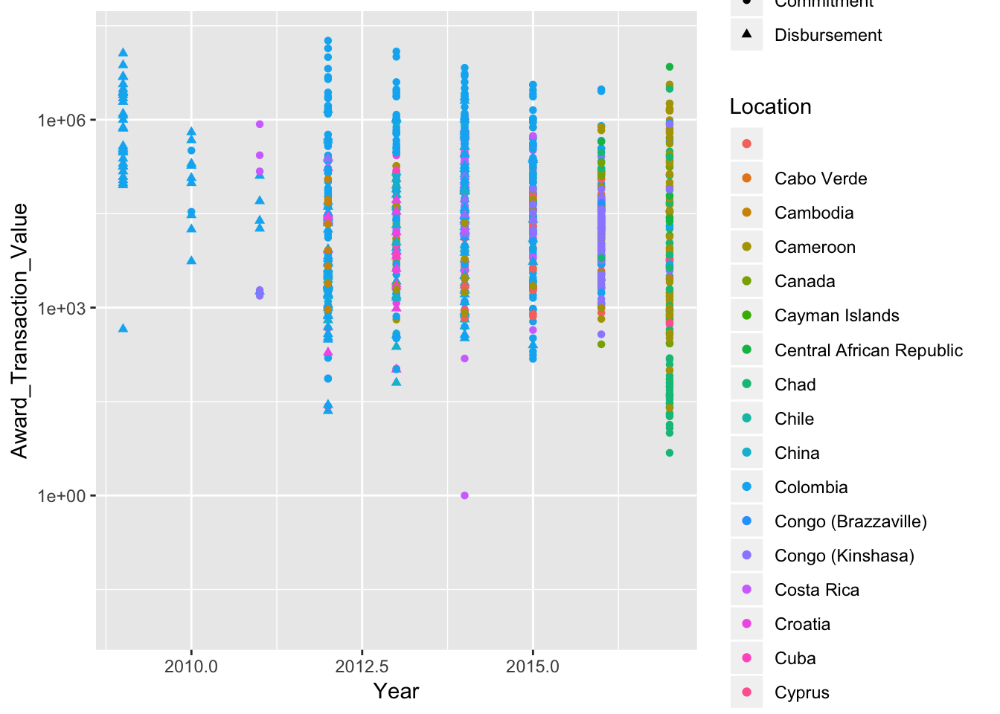

# Data visualization {#graphics}


## ggplot2

We'll be primarily using ggplot2 in this workshop. 

+ Makes pretty good formatting choices out of the box
+ Works like pipes!!
+ Is declarative (tell it what you want) without getting caught up in minutae
+ Strongly leverages data frames (good practice)
+ Fast enough
+ There are good templates if you want to change the look

The `ggplot2` package is a very flexible and (to me) intuitive way of visualizing data.
It is based on the concept of layering elements on a canvas.

> This idea of layering graphics on a canvas is, to me, a nice way of building graphs


+ A `data.frame` object
+ _Aesthetic mappings_ (aes) to say what data is used for what purpose in the viz
    + x- and y-direction
    + shapes, colors, lines
+ A _geometry object_ (geom) to say what to draw
    + You can "layer" geoms on each other to build plots

> `ggplot` used pipes before pipes were a thing. 
>
>However, it uses the `+` symbol for
piping rather than the `%>%` operator, since it pre-dates the `tidyverse`


```r
library(ggplot2)
ggplot(mtcars, aes(x = wt, y = mpg)) + geom_point()
```


+ A `data.frame` object: mtcars
+ Aesthetic mapping: 
    - x-axis: wt
    - y-axis: mpg
+ Geometry:
    + geom_point: draw points
    


```r
ggplot(mtcars, aes(x = wt, y = mpg)) + 
  geom_point()+ 
  geom_smooth()
```


+ A `data.frame` object: mtcars
+ Aesthetic mapping: 
    - x-axis: wt
    - y-axis: mpg
+ Geometry:
    + geom_point: draw points
    + geom_smooth: Add a layer which draws a best-fitting line
    
Now we clean up the plot to make it presentable.


## Single continuous variable

### Histogram


```r
dos <- import('data/Department of State.csv')
dos %>% 
  ggplot(aes(x = Award_Transaction_Value)) + geom_histogram()
```


Change the axis to the log scale for better visual


```r
dos %>% 
  ggplot(aes(x = Award_Transaction_Value)) + geom_histogram()+
  scale_x_log10() # x-axis on log scale
```


### Density plot


```r
dos %>% 
  ggplot(aes(x = Award_Transaction_Value)) + geom_density()+
  scale_x_log10()
```


## Bar plots


```r
library(lubridate)
dos %>% 
  group_by(year = year(as_date(Award_Start_Date))) %>% 
  summarize(amount = sum(Award_Transaction_Value)) %>% 
  ggplot(aes(x = year, y = amount)) + # Note change in pipe operator
    geom_bar(stat='identity')
```


### Exercise

Using the `mtcars` dataset in R, create:

1. A histogram of the fuel efficiences (`mpg`) in the data set
2. A bar plot of frequencies of number of cylinders (`cyl`) in the car


```r
ggplot(mtcars, aes(x = mpg)) + geom_histogram(binwidth=3)
```


```r
# ggplot(mtcars) + geom_histogram(aes(x = mpg), binwidth = 3)
```


```r
ggplot(mtcars, aes(x = factor(cyl))) + geom_bar()
```


## Two continuous variables

### Adding a best fitting straight line


```r
ggplot(mtcars, aes(x = hp, y = mpg))+
  geom_point()+
  geom_smooth(method = 'lm')
```


## Time series


```r
library(forecast)
d <- data.frame(x = 1:length(gas), y = gas) # Australian monthly gas production
ggplot(d, aes(x, y)) + geom_line()
```


### Exercise

1. Create a scatter plot of sepal length and sepal width from the `iris` dataset, and 
add a smooth line through it


## Continuous variable with discrete variable

### Boxplot


```r
dos %>% 
ggplot(aes(x = factor(year(as_date(Award_Start_Date))),
                y = Award_Transaction_Value))+
  geom_boxplot() +
  scale_y_log10()+
  labs(x = 'Year')
```


### Violin plot

This is essetially a reflected density plot and gives a better sense of the data distribution


```r
dos %>% 
ggplot(aes(x = factor(year(as_date(Award_Start_Date))),
                y = Award_Transaction_Value))+
  geom_violin() +
  scale_y_log10()+
  labs(x = 'Year')
```


### Exercise

1. Plot a boxplot of petal length by species using the `iris` dataset

## Grouped visualizations

We're going to plot the change in aid provided to each country over time. To do
this we need summaries by time and location

```r
grp_data <- dos %>% 
  group_by(Recipient_Location, year = year(as_date(Award_Start_Date))) %>% 
  summarize(amt = sum(Award_Transaction_Value)) %>% 
  filter(str_detect(Recipient_Location, '^C'))
ggplot(grp_data, aes(x = year, y = amt, color=Recipient_Location))+
  geom_line()+
  scale_y_log10()
```


```r
ggplot(grp_data, aes(x = year,  y = amt))+
  geom_line()+
  scale_y_log10()+
  facet_wrap(~Recipient_Location)
```


```r
## dos %>% filter(str_detect(Recipient_Location, '^C')) %>%
## ggplot(aes(x = year(as_date(Award_Start_Date)),
##            y = Award_Transaction_Value,
##            color = Recipient_Location,
##            shape = Award_Transaction_Type))+
##   geom_point()+
##   labs(x = 'Year', color='Location')+
##   scale_y_log10()
## 
```


```r
## dos %>% filter(str_detect(Recipient_Location, '^C')) %>%
## ggplot(aes(x = year(as_date(Award_Start_Date)),
##            y = Award_Transaction_Value,
##            color = Recipient_Location,
##            shape = Award_Transaction_Type))+
##   geom_jitter()+
##   labs(x = 'Year', color='Location')+
##   scale_y_log10()
## 
```


```r
schools <- rio::import('data/schools.rds')
schools %>% filter(tophead=='Elementary schools', 
                   head2=="Average hours in school day") %>% 
  filter(!is.na(State), State != 'United States') %>% 
  ggplot(aes(x = State, y = stats, ymin = stats - 2*se, 
             ymax = stats + 2*se)) +
  geom_pointrange()+
  labs(y = 'Avg hours in school day')+
  theme_bw()+
  theme(axis.text.x = element_text(angle=45, hjust = 1))
```

## Maps


We can also ingest SHP files to draw maps. We don't show the final version since 
it took too long to render. 

```r
library(sf)
hrr_info <- st_read('~/Downloads/hrr_bdry-1/HRR_Bdry.SHP')
head(hrr_info)
ggplot(hrr_info)+geom_sf()
ggsave('map.png')
```

## Stitching graphs together.


```r
# install.packages('cowplot')
library(cowplot)
p1 <- ggplot(iris, aes(Sepal.Length, Sepal.Width, color = Species)) +
 geom_point() + facet_grid(. ~ Species) + stat_smooth(method = "lm") +
 background_grid(major = 'y', minor = "none") +
 panel_border() + theme(legend.position = "none")

# plot B
p2 <- ggplot(iris, aes(Sepal.Length, fill = Species)) +
 geom_density(alpha = .7) + theme(legend.justification = "top")
p2a <- p2 + theme(legend.position = "none")

# plot C
p3 <- ggplot(iris, aes(Sepal.Width, fill = Species)) +
 geom_density(alpha = .7) + theme(legend.position = "none")

# legend
legend <- get_legend(p2)

# align all plots vertically
plots <- align_plots(p1, p2a, p3, align = 'v', axis = 'l')

# put together bottom row and then everything
bottom_row <- plot_grid(plots[[2]], plots[[3]], legend, labels = c("B", "C"), rel_widths = c(1, 1, .3), nrow = 1)
plot_grid(plots[[1]], bottom_row, labels = c("A"), ncol = 1)
```


```r
## library(ggplot2)
## library(plotly)
## p=ggplot(iris, aes(x=Sepal.Length,
##                    y=Sepal.Width,
##                    color=Species,
##                    shape=Species)) +
##     geom_point(size=6, alpha=0.6)
## mytext=paste("Sepal Length = ", iris$Sepal.Length,
##              "\n" , "Sepal Width = ", iris$Sepal.Width,
##              "\n", "Row Number: ",rownames(iris),  sep="")
## pp=plotly::plotly_build(p)
## style( pp, text=mytext,
##        hoverinfo = "text",
##        traces = c(1, 2, 3) )
```

## Interactive graphics {#interactive}

We won't put these in the notes, since they don't work well in printed form

