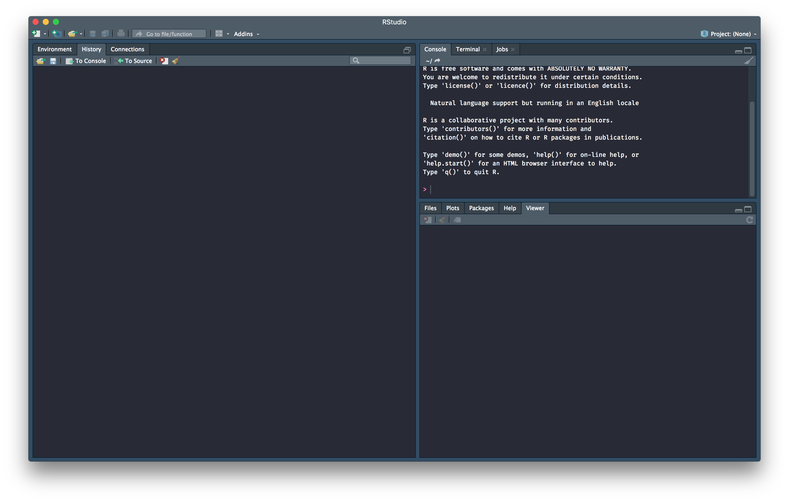

# RStudio, your development environment (authoring program)

While R is the language we will learn, [RStudio](http://www.rstudio.com) is the interface
(or _integrated development environment_) we will use to write it, interact with it, and see our
results. RStudio provides by far the most user-friendly interface to R (though it's not point-and-click). 

This is the "journal" or "notebook" in which you will start your writing journey in R

## Starting RStudio {-}

When you open RStudio, either from your desktop or from the Start menu, you'll 
see something like this:

> I'll note that I've done some customization to my console, which you can also do by going to 
  `Tools > Global Options`. Your screen will most likely have a white rather than a dark background

You can open a new panel for an R script using either `File > New File > R Script` or 
using the button at the top left of the window:

This opens up an R script file that you can edit and save. You will mainly be writing
in this panel within a R script (see \@ref(workflow) for more details).

You will also have a Console panel where the code will actually run in R. 

## Other panes {-}

There are several other panes in RStudio that we will see in due course. 

- __Environment__: This shows all the objects ("words") in your current environment
- __History__: This gives a history of the commands you have run. This is searchable. Though
  you do have a stored history, see \@ref(workflow) for why you shouldn't fall to temptation to
  just code in the console.
- __Files__: This is exactly like File Explorer in Windows, and lets you see the contents of 
  a folder/directory
- __Plot__: These is where the plots will show up. See \@ref(graphics) for more details on how to create plots
- __Packages__: This gives a listing of installed packages. You _can_ click on the tick boxes to 
  load packages into your environment, but I prefer coding it in (see section \@ref(pkg)) to make it 
  reproducible and verifiable. 
- __Help__: This will show help files once they are evoked
- __Viewer__: This pane shows results when they are produced as HTML documents. This pane 
  will also come into play once we start with interactive visualizations in section \@ref(interactive). 

Feel free to explore these different panes and understand their functionalities. 

## Rstudio workflow {#workflow}

As we've seen, RStudio has both a scripting pane to write code, and a console pane to run code. Of course, you can write code directly into the console, but it is **not** a good practice. You will tend to get sloppy, lose the "story", and generally have less reproducible code. 

Writing the program ("story") is just more reliable if you write into the script file and the send it to the console to run. Sending it to the console can be acheieved with a keyboard shortcut, Ctrl-Enter (or Cmd-Enter on a Mac). This is something that will be second nature while coding in RStudio.

When you write code, be sure to comment your code liberally. In R, any line or any phrase starting with `#` is considered a comment and is ignored by the program. This allows you to comment your code, explain your ideas to yourself and generally make your code more readable. To further this goal, write your code in differnt lines, and indent, to make it more readable; R ignores white space in your file.

Why bother doing this? Basically because the most likely next person to see your code is going to be you in 6 months, and you don't want to be scratching your head wondering what you were doing earlier (been there, done that, don't like it). You certainly can't phone your earlier self, so the best strategy is to write comments for your future self to minimize future grief. 

## RStudio Projects

Projects are a nice way to organize your data projects within RStudio. Projects keep together input data, R scripts, analytical results, and figures, and keeps different projects separate. Each project can run on its own independent R session (no worries about cross-hybridization), and you can have several projects open concurrently without risk of cross-pollinating them. 

To make a new project, click `File > New Project`, then:

