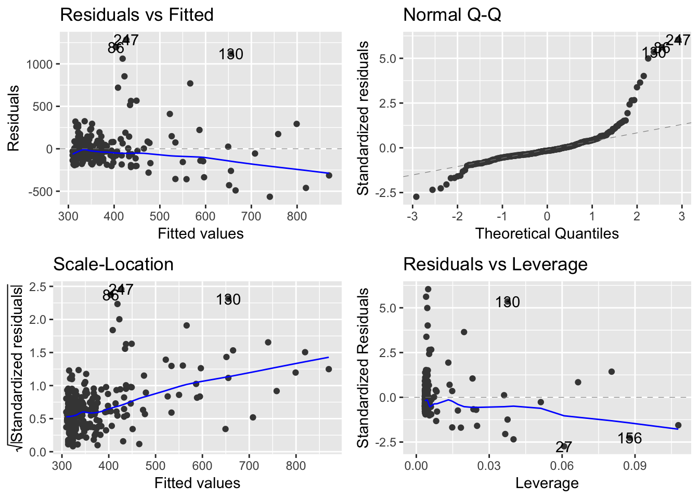
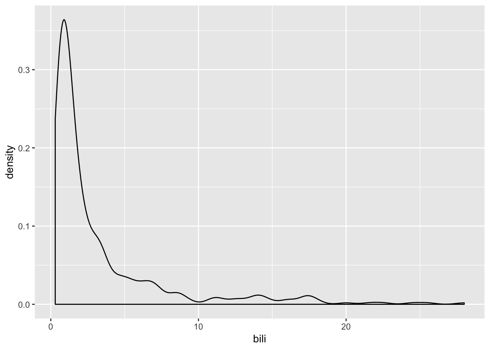
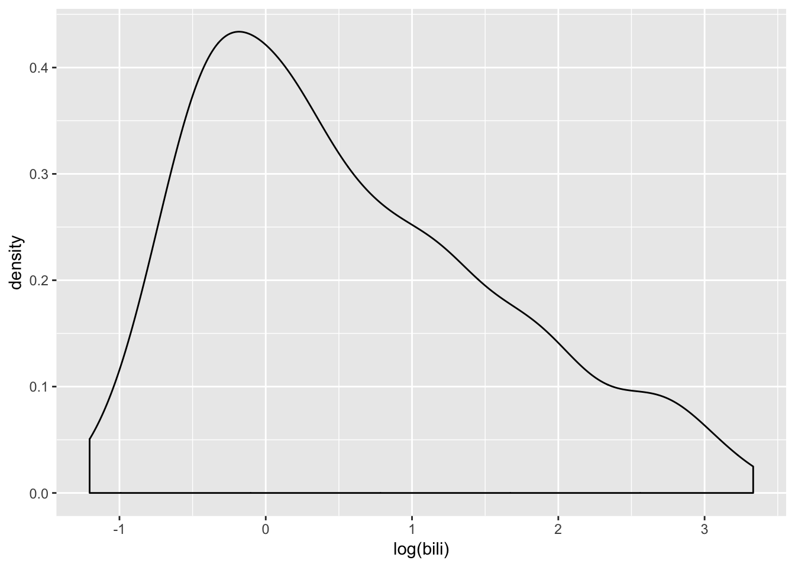
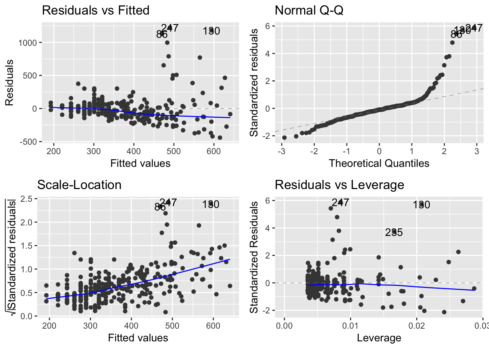
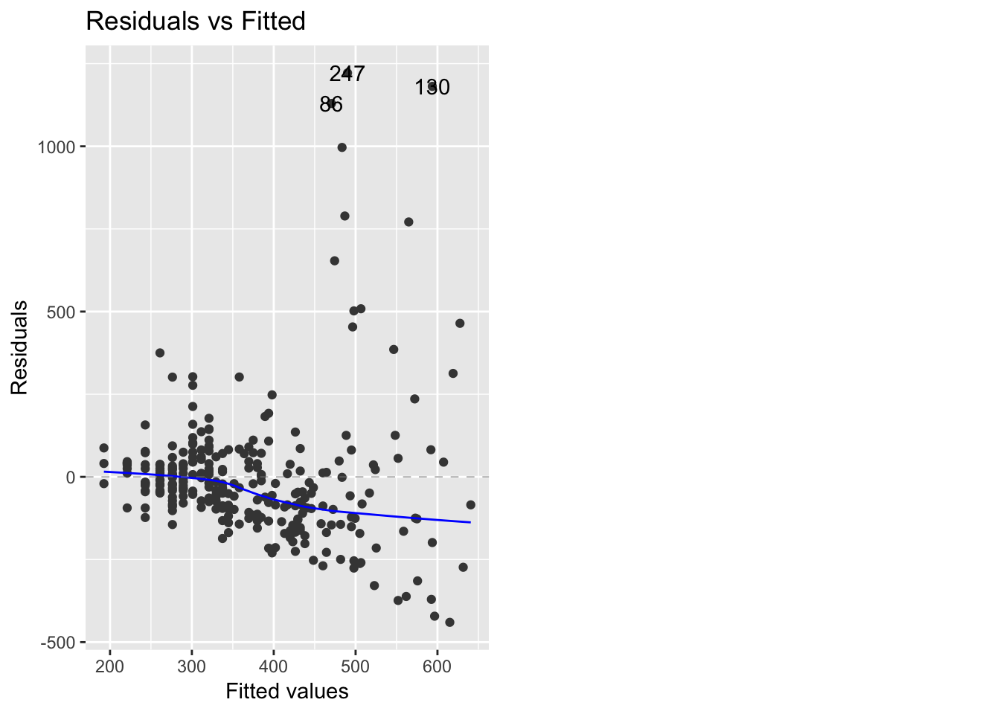
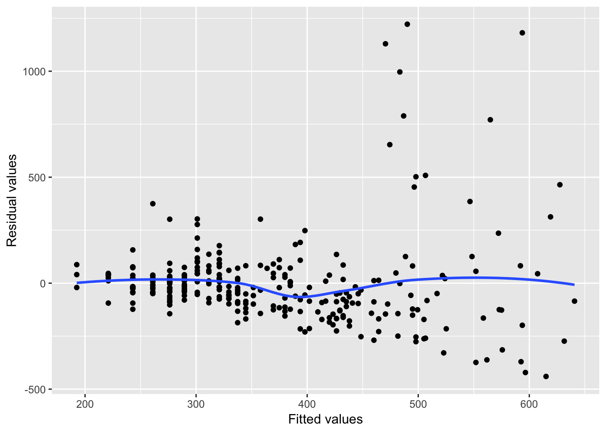

# Modeling


```r
library(survival)
data(pbc)
str(pbc)
```

```
'data.frame':	418 obs. of  20 variables:
 $ id      : int  1 2 3 4 5 6 7 8 9 10 ...
 $ time    : int  400 4500 1012 1925 1504 2503 1832 2466 2400 51 ...
 $ status  : int  2 0 2 2 1 2 0 2 2 2 ...
 $ trt     : int  1 1 1 1 2 2 2 2 1 2 ...
 $ age     : num  58.8 56.4 70.1 54.7 38.1 ...
 $ sex     : Factor w/ 2 levels "m","f": 2 2 1 2 2 2 2 2 2 2 ...
 $ ascites : int  1 0 0 0 0 0 0 0 0 1 ...
 $ hepato  : int  1 1 0 1 1 1 1 0 0 0 ...
 $ spiders : int  1 1 0 1 1 0 0 0 1 1 ...
 $ edema   : num  1 0 0.5 0.5 0 0 0 0 0 1 ...
 $ bili    : num  14.5 1.1 1.4 1.8 3.4 0.8 1 0.3 3.2 12.6 ...
 $ chol    : int  261 302 176 244 279 248 322 280 562 200 ...
 $ albumin : num  2.6 4.14 3.48 2.54 3.53 3.98 4.09 4 3.08 2.74 ...
 $ copper  : int  156 54 210 64 143 50 52 52 79 140 ...
 $ alk.phos: num  1718 7395 516 6122 671 ...
 $ ast     : num  137.9 113.5 96.1 60.6 113.2 ...
 $ trig    : int  172 88 55 92 72 63 213 189 88 143 ...
 $ platelet: int  190 221 151 183 136 NA 204 373 251 302 ...
 $ protime : num  12.2 10.6 12 10.3 10.9 11 9.7 11 11 11.5 ...
 $ stage   : int  4 3 4 4 3 3 3 3 2 4 ...
```

```r
myLinearModel <- lm(chol ~ bili, data = pbc)
```

```r
myLinearModel
```

```

Call:
lm(formula = chol ~ bili, data = pbc)

Coefficients:
(Intercept)         bili  
     303.20        20.24  
```

```r
summary(myLinearModel)
```

```

Call:
lm(formula = chol ~ bili, data = pbc)

Residuals:
    Min      1Q  Median      3Q     Max 
-565.39  -89.90  -35.36   44.92 1285.33 

Coefficients:
            Estimate Std. Error t value Pr(>|t|)    
(Intercept)  303.204     15.601  19.435  < 2e-16 ***
bili          20.240      2.785   7.267 3.63e-12 ***
---
Signif. codes:  0 '***' 0.001 '**' 0.01 '*' 0.05 '.' 0.1 ' ' 1

Residual standard error: 213.2 on 282 degrees of freedom
  (134 observations deleted due to missingness)
Multiple R-squared:  0.1577,	Adjusted R-squared:  0.1547 
F-statistic:  52.8 on 1 and 282 DF,  p-value: 3.628e-12
```

```r
broom::tidy(myLinearModel)
```

```
# A tibble: 2 x 5
  term        estimate std.error statistic  p.value
  <chr>          <dbl>     <dbl>     <dbl>    <dbl>
1 (Intercept)    303.      15.6      19.4  5.65e-54
2 bili            20.2      2.79      7.27 3.63e-12
```

```r
broom::glance(myLinearModel)
```

```
# A tibble: 1 x 11
  r.squared adj.r.squared sigma statistic  p.value    df logLik   AIC   BIC
      <dbl>         <dbl> <dbl>     <dbl>    <dbl> <int>  <dbl> <dbl> <dbl>
1     0.158         0.155  213.      52.8 3.63e-12     2 -1925. 3856. 3867.
# … with 2 more variables: deviance <dbl>, df.residual <int>
```

```r
## # install.packages('ggfortify')
## library(ggfortify)
## autoplot(myLinearModel)
```


```r
## ggplot(pbc, aes(x = bili))+geom_density()
```


```r
## ggplot(pbc, aes(x = log(bili)))+geom_density()
```


```r
myLinearModel2 <- lm(chol~log(bili), data = pbc)
summary(myLinearModel2)
```

```

Call:
lm(formula = chol ~ log(bili), data = pbc)

Residuals:
    Min      1Q  Median      3Q     Max 
-440.07  -94.35  -21.07   42.67 1221.86 

Coefficients:
            Estimate Std. Error t value Pr(>|t|)    
(Intercept)   311.48      14.28  21.816  < 2e-16 ***
log(bili)      98.80      12.07   8.186 9.42e-15 ***
---
Signif. codes:  0 '***' 0.001 '**' 0.01 '*' 0.05 '.' 0.1 ' ' 1

Residual standard error: 208.9 on 282 degrees of freedom
  (134 observations deleted due to missingness)
Multiple R-squared:  0.192,	Adjusted R-squared:  0.1891 
F-statistic: 67.01 on 1 and 282 DF,  p-value: 9.416e-15
```

```r
autoplot(myLinearModel2)
```



```r
autoplot(myLinearModel2, which=1)
```



```r
d <- broom::augment(myLinearModel2)
d
```

```
# A tibble: 284 x 10
   .rownames  chol log.bili. .fitted .se.fit .resid    .hat .sigma .cooksd
   <chr>     <int>     <dbl>   <dbl>   <dbl>  <dbl>   <dbl>  <dbl>   <dbl>
 1 1           261    2.67      576.    28.1 -315.  0.0181    208. 2.13e-2
 2 2           302    0.0953    321.    13.7  -18.9 0.00433   209. 1.79e-5
 3 3           176    0.336     345.    12.8 -169.  0.00373   209. 1.23e-3
 4 4           244    0.588     370.    12.4 -126.  0.00352   209. 6.41e-4
 5 5           279    1.22      432.    14.6 -153.  0.00487   209. 1.33e-3
 6 6           248   -0.223     289.    15.8  -41.4 0.00571   209. 1.14e-4
 7 7           322    0         311.    14.3   10.5 0.00467   209. 5.98e-6
 8 8           280   -1.20      193.    24.9   87.5 0.0142    209. 1.28e-3
 9 9           562    1.16      426.    14.2  136.  0.00463   209. 9.84e-4
10 10          200    2.53      562.    26.6 -362.  0.0162    208. 2.51e-2
# … with 274 more rows, and 1 more variable: .std.resid <dbl>
```

```r
ggplot(d, aes(x = .fitted, y = .resid))+geom_point()+ geom_smooth(se=F)+
  labs(x = 'Fitted values', y = 'Residual values')
```



```r
head(predict(myLinearModel2, newdata = pbc))
```

```
       1        2        3        4        5        6 
575.6925 320.9006 344.7277 369.5578 432.3941 289.4371 
```

```r
myLM3 <- lm(chol ~ log(bili) + sex, data = pbc)
broom::tidy(myLM3)
```

```
# A tibble: 3 x 5
  term        estimate std.error statistic  p.value
  <chr>          <dbl>     <dbl>     <dbl>    <dbl>
1 (Intercept)    283.       36.6     7.71  2.14e-13
2 log(bili)       99.6      12.1     8.22  7.37e-15
3 sexf            32.5      37.8     0.858 3.92e- 1
```

```r
myLR <- glm(spiders ~ albumin + bili + chol, data = pbc, family = binomial)
myLR
```

```

Call:  glm(formula = spiders ~ albumin + bili + chol, family = binomial, 
    data = pbc)

Coefficients:
(Intercept)      albumin         bili         chol  
  2.3326484   -0.9954927    0.0995915   -0.0003176  

Degrees of Freedom: 283 Total (i.e. Null);  280 Residual
  (134 observations deleted due to missingness)
Null Deviance:	    341.4 
Residual Deviance: 315.2 	AIC: 323.2
```

```r
broom::tidy(myLR)
```

```
# A tibble: 4 x 5
  term         estimate std.error statistic p.value
  <chr>           <dbl>     <dbl>     <dbl>   <dbl>
1 (Intercept)  2.33      1.30         1.80  0.0717 
2 albumin     -0.995     0.362       -2.75  0.00595
3 bili         0.0996    0.0344       2.89  0.00381
4 chol        -0.000318  0.000615    -0.517 0.605  
```

```r
broom::glance(myLR)
```

```
# A tibble: 1 x 7
  null.deviance df.null logLik   AIC   BIC deviance df.residual
          <dbl>   <int>  <dbl> <dbl> <dbl>    <dbl>       <int>
1          341.     283  -158.  323.  338.     315.         280
```

```r
head(predict(myLR))
```

```
          1           2           3           4           5           6 
 1.10554163 -1.77506554 -1.04814132 -0.09414055 -0.93144911 -1.62851203 
```

```r
head(predict(myLR, type='response'))
```

```
        1         2         3         4         5         6 
0.7512970 0.1449135 0.2595822 0.4764822 0.2826308 0.1640343 
```
## Model selection


```r
# install.packages('leaps')
library(leaps)
mtcars1 <- mtcars %>% mutate_at(vars(cyl, vs:carb), as.factor)
all_subsets <- regsubsets(mpg~., data = mtcars1)
all_subsets
```

```
Subset selection object
Call: regsubsets.formula(mpg ~ ., data = mtcars1)
16 Variables  (and intercept)
      Forced in Forced out
cyl6      FALSE      FALSE
cyl8      FALSE      FALSE
disp      FALSE      FALSE
hp        FALSE      FALSE
drat      FALSE      FALSE
wt        FALSE      FALSE
qsec      FALSE      FALSE
vs1       FALSE      FALSE
am1       FALSE      FALSE
gear4     FALSE      FALSE
gear5     FALSE      FALSE
carb2     FALSE      FALSE
carb3     FALSE      FALSE
carb4     FALSE      FALSE
carb6     FALSE      FALSE
carb8     FALSE      FALSE
1 subsets of each size up to 8
Selection Algorithm: exhaustive
```

```r
ind <- which.max(summary(all_subsets)$adjr2)
summary(all_subsets)$which[ind,]
```

```
(Intercept)        cyl6        cyl8        disp          hp        drat 
       TRUE        TRUE       FALSE       FALSE        TRUE       FALSE 
         wt        qsec         vs1         am1       gear4       gear5 
       TRUE       FALSE        TRUE        TRUE       FALSE       FALSE 
      carb2       carb3       carb4       carb6       carb8 
      FALSE       FALSE       FALSE       FALSE       FALSE 
```

## Many models

```r
mtcars <- as_tibble(mtcars)
mtcars %>% select(mpg, disp:qsec)
```

```
# A tibble: 32 x 6
     mpg  disp    hp  drat    wt  qsec
   <dbl> <dbl> <dbl> <dbl> <dbl> <dbl>
 1  21    160    110  3.9   2.62  16.5
 2  21    160    110  3.9   2.88  17.0
 3  22.8  108     93  3.85  2.32  18.6
 4  21.4  258    110  3.08  3.22  19.4
 5  18.7  360    175  3.15  3.44  17.0
 6  18.1  225    105  2.76  3.46  20.2
 7  14.3  360    245  3.21  3.57  15.8
 8  24.4  147.    62  3.69  3.19  20  
 9  22.8  141.    95  3.92  3.15  22.9
10  19.2  168.   123  3.92  3.44  18.3
# … with 22 more rows
```

```r
mtcars %>% select(mpg, disp:qsec) %>% 
  gather(variable, value, -mpg)
```

```
# A tibble: 160 x 3
     mpg variable value
   <dbl> <chr>    <dbl>
 1  21   disp      160 
 2  21   disp      160 
 3  22.8 disp      108 
 4  21.4 disp      258 
 5  18.7 disp      360 
 6  18.1 disp      225 
 7  14.3 disp      360 
 8  24.4 disp      147.
 9  22.8 disp      141.
10  19.2 disp      168.
# … with 150 more rows
```

```r
mtcars %>% select(mpg, disp:qsec) %>% 
  gather(variable, value, -mpg) %>% 
  group_by(variable) %>% 
  lm(mpg~value, data=.)
```

```

Call:
lm(formula = mpg ~ value, data = .)

Coefficients:
(Intercept)        value  
   21.28328     -0.01483  
```

```r
mtcars %>% select(mpg, disp:qsec) %>% 
  gather(variable, value, -mpg) %>% 
  nest(-variable)
```

```
# A tibble: 5 x 2
  variable data             
  <chr>    <list>           
1 disp     <tibble [32 × 2]>
2 hp       <tibble [32 × 2]>
3 drat     <tibble [32 × 2]>
4 wt       <tibble [32 × 2]>
5 qsec     <tibble [32 × 2]>
```

```r
bl <- mtcars %>% select(mpg, disp:qsec) %>% 
  gather(variable, value, -mpg) %>% 
  nest(-variable)
bl$data[[1]]
```

```
# A tibble: 32 x 2
     mpg value
   <dbl> <dbl>
 1  21    160 
 2  21    160 
 3  22.8  108 
 4  21.4  258 
 5  18.7  360 
 6  18.1  225 
 7  14.3  360 
 8  24.4  147.
 9  22.8  141.
10  19.2  168.
# … with 22 more rows
```

```r
mtcars %>% select(mpg, disp:qsec) %>% 
  gather(variable, value, -mpg) %>% 
  nest(-variable) %>% 
  mutate(models = map(data, ~lm(mpg~value, data=.)))
```

```
# A tibble: 5 x 3
  variable data              models  
  <chr>    <list>            <list>  
1 disp     <tibble [32 × 2]> <S3: lm>
2 hp       <tibble [32 × 2]> <S3: lm>
3 drat     <tibble [32 × 2]> <S3: lm>
4 wt       <tibble [32 × 2]> <S3: lm>
5 qsec     <tibble [32 × 2]> <S3: lm>
```

```r
 mtcars %>% select(mpg, disp:qsec) %>% 
  gather(variable, value, -mpg) %>% 
  nest(-variable) %>% 
  mutate(models = map(data, ~lm(mpg~value, data=.)),
         outputs = map(models, ~tidy(.)))
```

```
# A tibble: 5 x 4
  variable data              models   outputs         
  <chr>    <list>            <list>   <list>          
1 disp     <tibble [32 × 2]> <S3: lm> <tibble [2 × 5]>
2 hp       <tibble [32 × 2]> <S3: lm> <tibble [2 × 5]>
3 drat     <tibble [32 × 2]> <S3: lm> <tibble [2 × 5]>
4 wt       <tibble [32 × 2]> <S3: lm> <tibble [2 × 5]>
5 qsec     <tibble [32 × 2]> <S3: lm> <tibble [2 × 5]>
```

```r
 mtcars %>% select(mpg, disp:qsec) %>% 
  gather(variable, value, -mpg) %>% 
  nest(-variable) %>% 
  mutate(models = map(data, ~lm(mpg~value, data=.)),
         outputs = map(models, ~tidy(.))) %>% 
  select(variable, outputs)
```

```
# A tibble: 5 x 2
  variable outputs         
  <chr>    <list>          
1 disp     <tibble [2 × 5]>
2 hp       <tibble [2 × 5]>
3 drat     <tibble [2 × 5]>
4 wt       <tibble [2 × 5]>
5 qsec     <tibble [2 × 5]>
```

```r
 mtcars %>% select(mpg, disp:qsec) %>% 
  gather(variable, value, -mpg) %>% 
  nest(-variable) %>% 
  mutate(models = map(data, ~lm(mpg~value, data=.)),
         outputs = map(models, ~tidy(.))) %>% 
  select(variable, outputs) %>% 
  unnest()
```

```
# A tibble: 10 x 6
   variable term        estimate std.error statistic  p.value
   <chr>    <chr>          <dbl>     <dbl>     <dbl>    <dbl>
 1 disp     (Intercept)  29.6      1.23       24.1   3.58e-21
 2 disp     value        -0.0412   0.00471    -8.75  9.38e-10
 3 hp       (Intercept)  30.1      1.63       18.4   6.64e-18
 4 hp       value        -0.0682   0.0101     -6.74  1.79e- 7
 5 drat     (Intercept)  -7.52     5.48       -1.37  1.80e- 1
 6 drat     value         7.68     1.51        5.10  1.78e- 5
 7 wt       (Intercept)  37.3      1.88       19.9   8.24e-19
 8 wt       value        -5.34     0.559      -9.56  1.29e-10
 9 qsec     (Intercept)  -5.11    10.0        -0.510 6.14e- 1
10 qsec     value         1.41     0.559       2.53  1.71e- 2
```

```r
 mtcars %>% select(mpg, disp:qsec) %>% 
  gather(variable, value, -mpg) %>% 
  nest(-variable) %>% 
  mutate(models = map(data, ~lm(mpg~value, data=.)),
         outputs = map(models, ~tidy(.))) %>% 
  select(variable, outputs) %>% 
  unnest() %>% 
  filter(term=='value')
```

```
# A tibble: 5 x 6
  variable term  estimate std.error statistic  p.value
  <chr>    <chr>    <dbl>     <dbl>     <dbl>    <dbl>
1 disp     value  -0.0412   0.00471     -8.75 9.38e-10
2 hp       value  -0.0682   0.0101      -6.74 1.79e- 7
3 drat     value   7.68     1.51         5.10 1.78e- 5
4 wt       value  -5.34     0.559       -9.56 1.29e-10
5 qsec     value   1.41     0.559        2.53 1.71e- 2
```

```r
 mtcars %>% select(mpg, disp:qsec) %>% 
  gather(variable, value, -mpg) %>% 
  nest(-variable) %>% 
  mutate(models = map(data, ~lm(mpg~value, data=.)),
         outputs = map(models, ~tidy(.))) %>% 
  select(variable, outputs) %>% 
  unnest() %>% 
  filter(term=='value') %>% 
  mutate_if(is.numeric, funs(round(., 3)))
```

```
# A tibble: 5 x 6
  variable term  estimate std.error statistic p.value
  <chr>    <chr>    <dbl>     <dbl>     <dbl>   <dbl>
1 disp     value   -0.041     0.005     -8.75   0    
2 hp       value   -0.068     0.01      -6.74   0    
3 drat     value    7.68      1.51       5.10   0    
4 wt       value   -5.34      0.559     -9.56   0    
5 qsec     value    1.41      0.559      2.52   0.017
```

# Predictive modeling


```r
library(tidyverse)
library(caret)
data(diamonds)
set.seed(12356)
diamonds_train <- diamonds %>% sample_frac(size = 0.8) # 80%
diamonds_test <- anti_join(diamonds, diamonds_train)
(nrow(diamonds) == nrow(diamonds_train) + nrow(diamonds_test))
```

```
[1] FALSE
```

